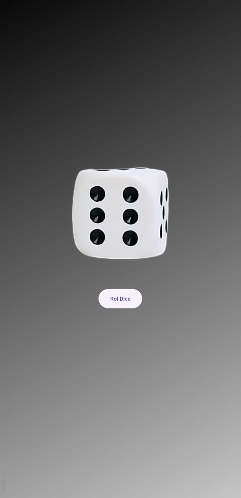

# Roll Dice
A simple Flutter application that simulates rolling dice. This app generates random dice roll results and provides a visual representation of the dice face.

## Features
- Easy-to-use and intuitive interface
- Image scaling depends on the width and height of the screen
- Provides haptic feedback for a tactile experience

